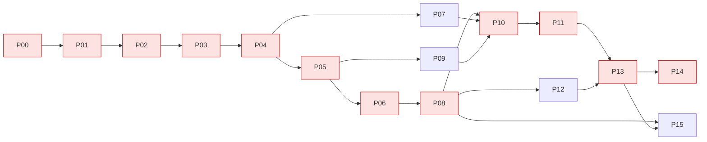

# 00 — Master Plan · SQE A2 on PX4-Autopilot v1.17.0

## 1. Objective and fixed decisions
Derive, implement, execute and defend white-box tests for a substantial PX4 business/control-logic scope, reaching 100 % statement and
100 % decision/branch coverage where feasible, full MC/DC evidence for one critical component, and a scoped quality judgment.

Decisions already taken by static analysis of v1.17.0 (re-confirmed in P04; see `docs/reference/REF_02_SCOPE_CANDIDATES.md`):
| Area | Production files | Critical behaviour | PX4 test level |
|---|---|---|---|
| A | `src/modules/sensors/data_validator/DataValidator.cpp` | per-sensor health/confidence (timeout, stale, error count/density) | GTest **unit** |
| B | `src/modules/sensors/data_validator/DataValidatorGroup.cpp` | redundant-sensor selection & failover classification (IMU accel/gyro, mag) — **MC/DC component (A+B)** | GTest **unit** |
| C | `src/modules/commander/failure_detector/FailureDetector.cpp` | attitude/ESC/motor/imbalanced-prop failure detection → failsafe | GTest **functional** |
| D | `src/modules/commander/failure_detector/FailureInjector.cpp` | motor failure injection in FailureDetector's control path | GTest **functional** |
SITL-level tests are not required (no driver/scheduler/full-stack dependency); this is argued in P04.

## 2. Phase table
| Phase | Name | Owner | Needs | Produces (main) | Effort* |
|---|---|---|---|---|---|
| P00 | Workspace bootstrap | ORCH | kit | `work/`, `evidence/`, TEAM, STATUS | 0.5 h |
| P01 | Environment + baseline clone | ENV | G00 | clone @ d6f12ad, env report | 2–4 h |
| P02 | Baseline build + upstream tests | ENV | G01 | `make tests` log, ctest list | 1–2 h (+ build) |
| P03 | Coverage pipeline + baseline coverage | COV | G02 | baseline scope.info + HTML | 2–3 h (+ build) |
| P04 | Repository analysis + scope | ANL | G03 | SCOPE_RECORD, candidate matrix | 3 h |
| P05 | Structural test basis | ANL | G04 | verified inventories, SETUP_MAP, obligations | 4–5 h |
| P06 | MC/DC derivation | MCDC | G05 | mcdc_matrix.csv, MCDC_ANALYSIS | 4–6 h |
| P07 | Impl A — DataValidator (unit) | IMPL | G04 (+G05 soft) | SqeDataValidatorTest.cpp | 4–6 h |
| P08 | Impl B — DataValidatorGroup (unit, MC/DC) | IMPL | G06 | SqeDataValidatorGroupTest.cpp | 6–8 h |
| P09 | Impl C — FailureDetector/Injector (functional) | IMPL | G05 | 3 functional test files | 8–10 h |
| P10 | Coverage measurement + iteration | COV | G07–G09 | final coverage, iterations log, GAPS | 4–8 h |
| P11 | Findings, gaps, defects | AUD/DOC | G10 | FINDINGS, probes, GAPS final | 3–4 h |
| P12 | Workbook (.xlsx) | DOC | G08 (incremental) | `<BASE>.xlsx` | 2 h |
| P13 | Report | DOC | G11, G12 | `<BASE>.pdf` | 6–8 h |
| P14 | Packaging + reproduction dry run | ORCH/PKG | G13 | patch, zip, checklist | 2–3 h (+ build) |
| P15 | Viva preparation | all | G08→ | drills, Q&A, unique-coverage table | 4–6 h |
*Active effort; first builds add 20–90 min wall-clock each (machine dependent).

## 3. Dependency graph and critical path

**Critical path:** P00 → P01 → P02 → P03 → P04 → P05 → P06 → P08 → P10 → P11 → P13 → P14.
Longest wall-clock items: first recursive clone, first `make tests`, the Coverage rebuild, and the P14 dry-run build. Start them early
and do analysis (P04/P05 reading) while they compile.

## 4. Gates (a human must mark APPROVED in `work/STATUS.md`)
| Gate | Pass criteria (objective) | Verification |
|---|---|---|
| G00 | Workspace dirs exist; TEAM.md filled; STATUS initialised | `ls work evidence deliverables`; `cat work/TEAM.md` |
| G01 | HEAD = d6f12ad…; tag verified; submodules initialised; env report complete | `git -C PX4-Autopilot rev-parse HEAD`; `cat evidence/env/environment.md` |
| G02 | `make tests` executed; ctest summary saved; failures (if any) classified pre-existing | `tail -30 evidence/baseline/make_tests.log` |
| G03 | Coverage build OK; baseline scope.info + HTML + MANIFEST present; branch data present (BRF > 0) | `tools/sqe_lcov_report.py summary evidence/coverage/baseline/scope.info` |
| G04 | SCOPE_RECORD complete for areas A–D incl. level justification & exclusions; candidate matrix re-verified | auditor report `work/audit/G04.md` |
| G05 | Inventories verified line-by-line; every decision has outcomes, conditions, setup, planned tests; infeasible items have proofs | `grep -c "| DV-D" work/basis/INVENTORY_DataValidator.md` etc. |
| G06 | `tools/sqe_mcdc_check.py work/mcdc/mcdc_matrix.csv` passes; MCDC_ANALYSIS justifies component + behaviour | script exit 0 |
| G07 | `unit-SqeDataValidator` green, warning-free, shuffle ×5 stable | `tools/sqe_run_tests.sh run && tools/sqe_run_tests.sh shuffle` |
| G08 | `unit-SqeDataValidatorGroup` green; every MC/DC row executed; per-test evidence for O3 rows | `evidence/tests/xml/unit-SqeDataValidatorGroup.xml` |
| G09 | 3 functional binaries green; `--gtest_repeat=10 --gtest_shuffle` stable | `evidence/tests/shuffle_*.log` |
| G10 | Final coverage captured; iterations logged; every uncovered item in GAPS with class + justification | `tools/sqe_lcov_report.py gaps …` |
| G11 | Every FAIL/BLOCKED investigated (SPEC_10); findings classified; probes approved or dropped | `work/FINDINGS.md` |
| G12 | Workbook validates (≤ 2 sheets, 1:1 with tests, MC/DC complete) | `python3 tools/sqe_workbook.py … --validate` |
| G13 | Report complete; all numbers traceable to evidence; judgment 300–400 words | `python3 tools/sqe_word_count.py deliverables/report/REPORT.md` |
| G14 | Patch applies to fresh v1.17.0 worktree; dry run reproduces final numbers; names follow convention | `tools/sqe_make_patch.sh verify` |
| G15 | Each student passed the mock viva checklist | `work/viva/drill_log.md` |

## 5. Rubric → artifact map
| Rubric component (marks) | Where it is earned |
|---|---|
| Repository analysis & structural basis (20) | P01–P05 → report §2–§4, `work/basis/*` (summarised), baseline evidence |
| Structural derivation & MC/DC (30) | P05–P09 → test catalogue in phase files, workbook Sheet 1 + Sheet 2, report §5 |
| Test implementation & execution (15) | P07–P09 → test sources, CMake lines, `evidence/tests/*` (xml + logs), shuffle runs |
| Coverage measurement & gap analysis (20) | P03, P10 → baseline/final HTML + .info, iterations log, GAPS with proofs |
| Findings & final judgment (15) | P11, P13 → findings (with reproduction), limitations, 300–400-word judgment |
| Viva (deductions apply to all) | P15 → drills, per-test unique coverage, explain-back notes |

## 6. Risk register (top)
| ID | Risk | Mitigation |
|---|---|---|
| RK-01 | Toolchain/build failure on a student OS | REF_10 fixes; `-j2`; PX4 dev container on the same laptop as last resort (still local) |
| RK-02 | macOS Clang Coverage flag typo (`-O0-fprofile-arcs`) | P01 tooling fix, logged in production_change_log (flags only) |
| RK-03 | lcov 1.x/2.x flag differences | `tools/sqe_coverage.sh` auto-detects from installed `lcovrc`; versions in MANIFEST |
| RK-04 | Flaky time-based functional tests | documented minimum trigger times + ≥ 1.5× margins, never assert elapsed upper bounds, repeat ×10 |
| RK-05 | uORB/param leakage between TEST_Fs | SetUp resets; publish-before-update; separate binary for multi-instance IMU tests |
| RK-06 | Scope too large for the time box | order: P08 (MC/DC) → P07 → P09-FD → P09-FI; unfinished items become documented gaps, never silent exclusions |
| RK-07 | Students cannot defend AI-written tests | explain-back per phase, `/sqe-explain`, P15 drills, ownership map (AGENTS.md §4) |
| RK-08 | SITL baseline coverage nondeterministic (10 s timed SITL test) | capture baseline twice; report range if different |
| RK-09 | Overclaiming / integrity issues | R3/R12, auditor at every gate, AI record, no raw transcripts |

## 7. Suggested calendar (3 students, ~2 weeks)
Day 1: P00–P01 (all), start clone + first build overnight · Day 2: P02–P03 · Day 3: P04–P05 · Day 4–5: P06 + P07 ∥ P09-FD ·
Day 6–7: P08 ∥ P09-FI · Day 8: P10 · Day 9: P11 + P12 · Day 10–11: P13 · Day 12: P14 dry run · Day 13–14: P15 drills + buffer.

## 8. How to run with Claude Code
`/sqe-status` → `/sqe-phase Pxx` → read `work/explain/Pxx.md` + `work/audit/Gxx.md` → human sets gate `APPROVED` → next phase.
Long builds: let Claude Code start them with `run_in_background` or run them yourself and paste the log path.
