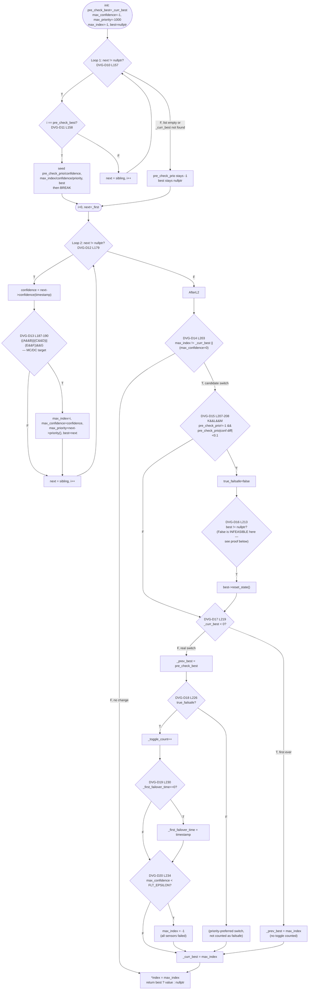

# CFG — `DataValidatorGroup::get_best(uint64_t timestamp, int *index)` (lines 140-246)

## Reading notes
- **Two passes over the sibling list**: Loop 1 finds the *previously* selected sensor's current confidence (the
  "pre-check"), Loop 2 scans every sensor to find the new best by the switch-worthy criteria in D13. A sensor that
  isn't the previous best never gets its confidence computed in Loop 1 — only in Loop 2.
- **D13 is evaluated once per sibling per call**, inside Loop 2 — not once per `get_best()` call. With N siblings,
  D13 is evaluated N times, each with potentially different A-G truth values (since `confidence`, `max_confidence`,
  `next->priority()`, `max_priority` all change across iterations as `best` gets updated). This is why the MC/DC
  independence pairs (REF_06 §3) must be constructed per-call, holding the loop iteration fixed conceptually (i.e.
  as if testing one sensor's effect on one decision evaluation), not confused with "coverage across iterations."
- **DVG-D16 infeasibility proof** (re-derived, not just copied from REF_04): `best` is only non-null-by-construction
  after Loop 1's `Seed` step (L162-168) or after D13's `UpdateBest` step in Loop 2 (L191-195) — both set `best` in the
  same statement block that would also make `pre_check_prio != -1` true (Loop 1's seed sets `pre_check_prio` at
  L162, `best` at L168, same `if` body). So if D15's K (`pre_check_prio != -1`) evaluates True, `best` was
  necessarily assigned during Loop 1 — D16's False branch (`best == nullptr`) is unreachable whenever we get to D16
  at all (D16 is only reached when D15 is True, i.e. K is already True). **Confirmed by reading L156-174 directly.**
- **Early exit via `break`** in both Loop 1 (L169) and the inner `if (i == index)` style in `put()` — once the target
  sibling is found, remaining siblings aren't visited that call. "Not reached" for later siblings in Loop 1 is not
  the same as "condition evaluated False" — it's simply not evaluated at all once `break` fires.
- **Back edge**: both `while` loops' `next = next->sibling(); i++;` tail is the back edge revisiting the loop
  condition (D10/D12) — standard linked-list traversal, terminates because `sibling()` eventually returns `nullptr`
  (enforced by the constructor's `_last->sibling() == nullptr` invariant, never mutated to form a cycle anywhere in
  this file).
