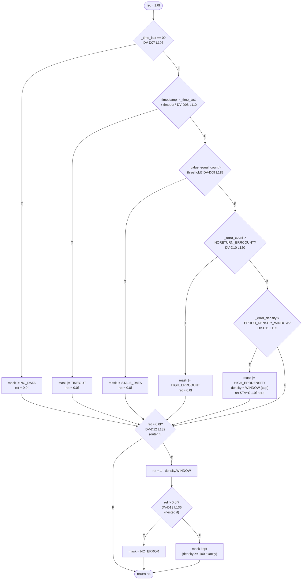

# CFG — `DataValidator::confidence(uint64_t timestamp)` (lines 100-142)

## Reading notes
- The five `if`/`else-if` branches (D07-D11) are **mutually exclusive** — only one of NO_DATA / TIMEOUT / STALE_DATA /
  HIGH_ERRCOUNT / HIGH_ERRDENSITY can fire per call, because they're chained with `else if`. This matters for test
  design: you cannot reach D09 (STALE) without first making D07 and D08 both False.
- **D11's True branch is a trap for naive testers**: unlike D07-D10, triggering HIGH_ERRDENSITY does *not* set
  `ret = 0.0f`. It caps `_error_density` but leaves `ret` at its initial `1.0f`, so execution falls into the D12 `True`
  branch and `ret` gets recomputed as `1 - density/WINDOW` — which, since density is now capped exactly at
  `ERROR_DENSITY_WINDOW` (100.0f), evaluates to `1 - 100/100 = 0.0f`. So D13 (nested) is reached with `ret == 0.0f`,
  taking the **False** branch (mask kept, not cleared) — this is the "density == 100 → F" case REF_03 flags at D11/D13.
  A test must distinguish "ret became 0 via the early-exit branches" from "ret became 0 via the D12/D13 computed path"
  to actually exercise this edge.
- **Early exit vs. fall-through**: D07/D08/D09/D10 are early-exit-style (each sets `ret=0.0f` and the mask, then the
  chain ends because of `else if`), but there's no `return` — execution always reaches D12. D12's condition
  (`ret > 0.0f`) is what actually distinguishes "no error occurred above" (ret still 1.0f, or became 0 via D11
  specifically) from "a hard error occurred" (ret forced to 0.0f by D07-D10) and skips the whole recompute block for
  the latter.
- "Not reached ≠ False": the `print()` function (DV-D14/D15) calls `confidence(hrt_absolute_time())` again, as a
  *side effect of formatting output* — this means calling `print()` can itself change `_error_mask` (via D13), which
  is a real side-effect trap: a test that calls `print()` for diagnostic purposes between two confidence-affecting
  assertions can inadvertently mutate state (flagged in REF_03 as side effect F-05, cross-referenced from DV-D15).
