# CFG — `FailureDetector::updateMotorStatus(vehicle_status, esc_status)` (lines 246-354)

```mermaid
flowchart TD
    Start(["copy actuator_motors"]) --> D29{"DVG-D29/FD-D29 L259<br/>arming_state == ARMED?"}
    D29 -->|F, disarmed| Reset["reset undercurrent timers (all)<br/>under_current_mask = 0<br/>flags.motor = false"]
    Reset --> End1(["return"])

    D29 -->|T, armed| LoopStart(["for esc_status_idx in<br/>[0, limited_esc_count)<br/>FD-D30 L267"])
    LoopStart --> Map["i_esc = actuator_function<br/>- MOTOR1"]
    Map --> D31{"FD-D31 L274<br/>i_esc >= NUM_CONTROLS?<br/>(unsigned wrap guard)"}
    D31 -->|T| ContinueLoop["continue (skip this ESC)"]
    D31 -->|F| D32{"FD-D32 L279<br/>!(valid_mask & bit) &&<br/>esc_current > 0?"}
    D32 -->|T| MarkValid["valid_current_mask |= bit"]
    D32 -->|F| D33Prep
    MarkValid --> D33Prep(["compute esc_timed_out,<br/>esc_was_valid,<br/>esc_timeout_currently_flagged"])
    D33Prep --> D33{"FD-D33 L288<br/>was_valid && timed_out &&<br/>!currently_flagged?"}
    D33 -->|T| SetTimedOut["timed_out_mask |= bit"]
    D33 -->|F| D34{"FD-D34 L292<br/>!timed_out && currently_flagged?"}
    D34 -->|T| ClearTimedOut["timed_out_mask &= ~bit"]
    D34 -->|F| D35
    SetTimedOut --> D35
    ClearTimedOut --> D35
    D35{"FD-D35 L298<br/>esc_current > FLT_EPSILON?"}
    D35 -->|T| MarkHasCurrent["has_current[i_esc] = true"]
    D35 -->|F| D36
    MarkHasCurrent --> D36
    D36{"FD-D36 L302<br/>has_current[i_esc]?<br/>(latched — once true,<br/>stays true forever,<br/>see note)"}
    D36 -->|F| LoopNext
    D36 -->|T| D37{"FD-D37 L305<br/>PX4_ISFINITE(control[i_esc])?"}
    D37 -->|T| UseControl["esc_throttle = fabsf(control[i_esc])"]
    D37 -->|F| ZeroThrottle["esc_throttle = 0<br/>(NaN guard)"]
    UseControl --> D38
    ZeroThrottle --> D38
    D38{"FD-D38 L313<br/>throttle_above && current_too_low<br/>&& !esc_timed_out?"}
    D38 -->|T| D39{"FD-D39 L314<br/>undercurrent_start==0?"}
    D39 -->|T| StartTimer["undercurrent_start[i_esc] = now"]
    D39 -->|F,already started| D38TrueNoop["(timer already running,<br/>no change)"]
    D38 -->|F| D40{"FD-D40 L319<br/>undercurrent_start!=0?"}
    D40 -->|T| ResetTimer["undercurrent_start[i_esc]=0"]
    D40 -->|F| D41Prep
    StartTimer --> D41Prep
    D38TrueNoop --> D41Prep
    ResetTimer --> D41Prep(["—"])
    D41Prep --> D41{"FD-D41 L324-326<br/>start!=0 && now>start+tout<br/>&& !(under_current_mask & bit)"}
    D41 -->|T| LatchUnderCurrent["under_current_mask |= bit<br/>(NEVER CLEARED —<br/>see note)"]
    D41 -->|F| LoopNext
    LatchUnderCurrent --> LoopNext["esc_status_idx++"]
    LoopNext --> LoopStart
    LoopStart -.loop exits.-> D42
    D42{"FD-D42 L334<br/>timed_out_mask!=0 ||<br/>under_current_mask!=0?"}
    D42 -->|T| D43{"FD-D43 L336<br/>critical && !flags.motor?"}
    D43 -->|T| SetMotorFlag["flags.motor = true"]
    D43 -->|F| End2(["return"])
    D42 -->|F| D44{"FD-D44 L340<br/>!critical && flags.motor?"}
    D44 -->|T| ClearMotorFlag["flags.motor = false"]
    D44 -->|F| End2
    SetMotorFlag --> End2
    ClearMotorFlag --> End2
```

## Reading notes
- **Guard order matters**: D31 (`i_esc >= NUM_CONTROLS`) runs *before* any mask operation uses `i_esc` as a shift
  amount in this function — contrast with `FailureInjector::manipulateEscStatus` (FI-D11/D12), which has **no**
  equivalent guard before its own `1 << i_esc` shift (confirmed defect F-07, independently verified against the real
  source). This function (`FailureDetector::updateMotorStatus`) does it correctly; `FailureInjector` does not — worth
  noting precisely because the contrast makes F-07 easy to demonstrate in a test/finding.
- **D36 is a latch, not a live check**: `_motor_failure_esc_has_current[i_esc]` is only ever set `true` (D35→D36 one
  direction), never reset to `false` anywhere in this function or its disarmed-branch reset block (which only clears
  `undercurrent_start_time` and `under_current_mask`, not `has_current`). So once an ESC has reported *any* current
  reading > `FLT_EPSILON`, the under-current detection logic (D37-D41) runs for it on every subsequent call for the
  lifetime of the `FailureDetector` object — a test exercising D37-D41 branches must first "warm up" that ESC's
  `has_current` latch via a prior call with nonzero current.
- **D41's under-current mask bit is also never cleared** once set (the code comment at L330 says this explicitly:
  "this flag is never cleared, as the motor is stopped, so throttle < threshold") — this is a deliberate latch
  (the motor gets commanded to zero throttle once flagged, so the under-current condition can't naturally recur to
  un-latch it), not a bug, but it means a test suite that wants to observe the flag clearing must either construct a
  fresh `FailureDetector` or explicitly exercise the disarm/rearm reset path (D29 False branch) rather than expect
  D41's True branch to toggle back and forth.
- **Why this function (not `updateAttitudeStatus` or `updateEscsStatus`) for the third CFG sketch**: it's the single
  most decision-dense function in the whole scope (17 decision points inside one function body: D29-D44 inclusive,
  16 IDs plus the implicit loop-exit), with the richest mix of simple ifs, compound conditions (D33, D38, D41), a
  latch pattern (D36), and a genuinely interesting contrast case (the F-07 guard it has that `FailureInjector` lacks)
  — the most instructive single function to walk through in the viva.
